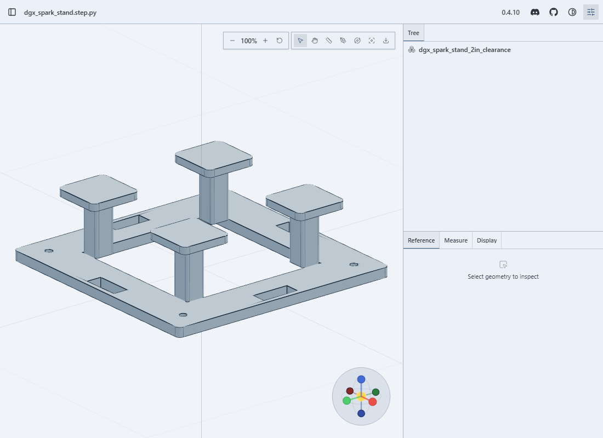
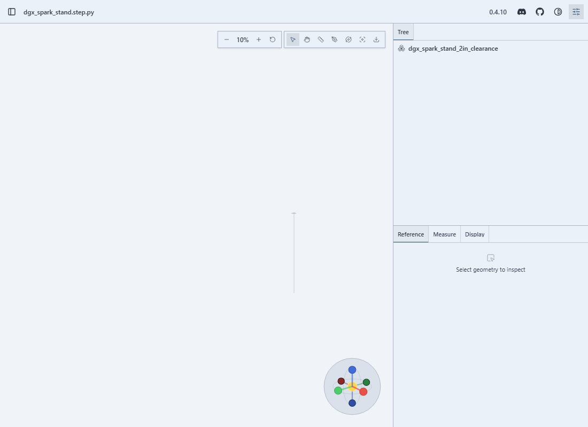
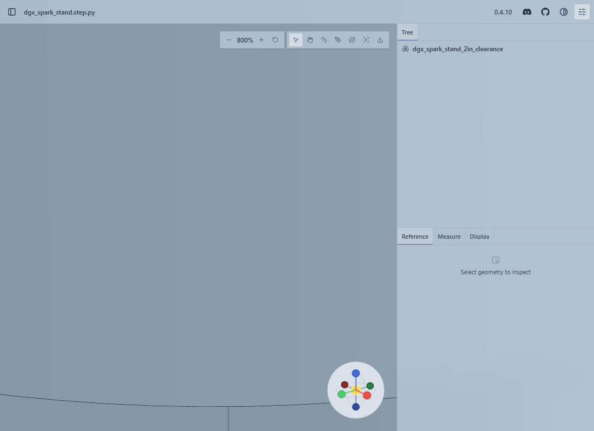
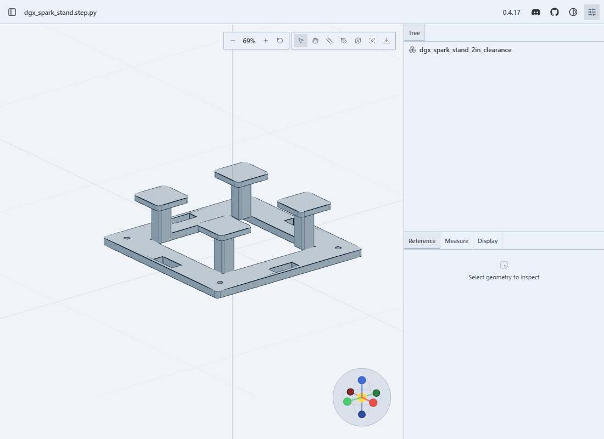

## What's wrong

Wheel zoom is unusable. Two or three wheel notches at 100% land you at 10% zoomed out or pin the view at 800%, and `zoomToCursor` makes it feel like the camera is being flung. Scroll-zoom should take many notches to cross that range, not a flick of the wheel.

## Root cause

OrbitControls scales camera distance by `0.95^(zoomSpeed * delta/100)` per wheel event. This viewer handed it `zoomSpeed = 10` for the accelerated wheel path (`ACCELERATED_WHEEL_ZOOM_SPEED`) and `4.5` for the main path (`DEFAULT_ZOOM_SPEED`). Both are orders of magnitude off the upstream default of `1.0`, so one notch moves the camera by a factor far beyond the viewable range.

## The fix

`viewer/src/client/components/CadViewer.js`, constants only:

- `ACCELERATED_WHEEL_ZOOM_SPEED`: 10 → 1.0
- `DEFAULT_ZOOM_SPEED`: 4.5 → 1.0
- `COARSE_POINTER_ZOOM_SPEED`: 1.6 → 1.0
- `TRACKPAD_PINCH_ZOOM_SPEED`: 14 → 2.0 (trackpads send many small deltas, so it stays a little ahead of a plain wheel)
- `COARSE_POINTER_PINCH_ZOOM_SPEED`: 2.4 → 1.6

## Verification

Headless Chromium + Playwright, one wheel notch = delta 120, model = a 150×150×50 mm part (the DGX Spark stand):

- Before: 3 notches out → 10% (model becomes a dot); 5 notches in → 800% (useless perspective).
- After: 6 notches out → ~69%, whole model stays visible; 6 notches back in → returns to ~100%. No blanking at any step.

Numbers came from the same scripted input both before and after the change.

Screenshots attached.

## Evidence

Before:
- 100% baseline: 
- Zoom out, 3 notches → 10% (model a dot): 
- Zoom in, 5 notches → 800%: 

After (this branch):
- 6 notches out → ~69%, full model still visible: 
- 6 notches back in → ~100%: 

Repro: Playwright + headless Chromium, one wheel notch = deltaY 120, against the exported STEP model (the 150×150×50 mm DGX Spark stand). Steps: load the page, wheel 6x out, 6x in, screenshot at each limit. Same script run before and after the change.
