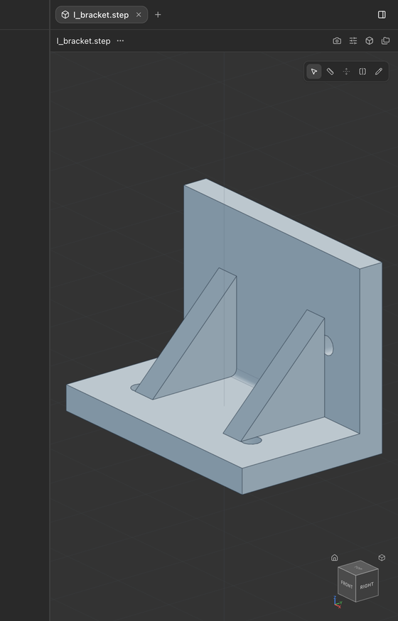
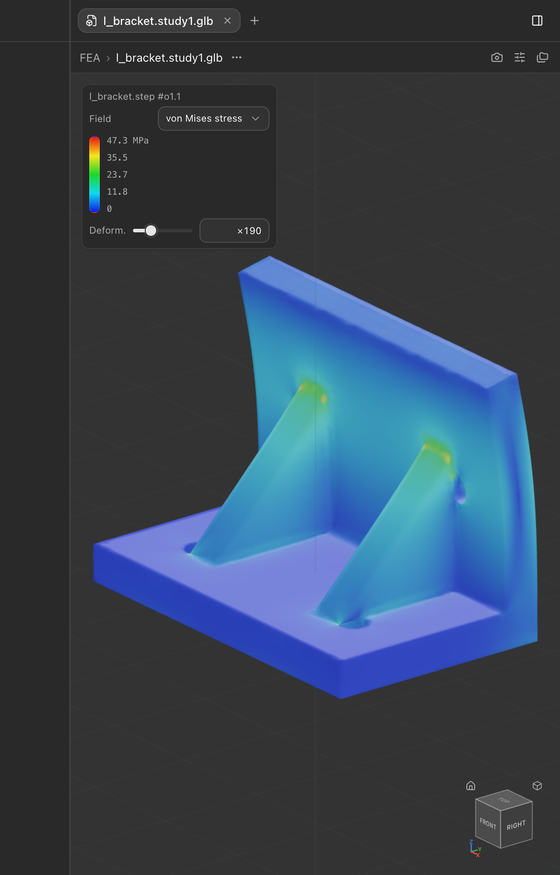
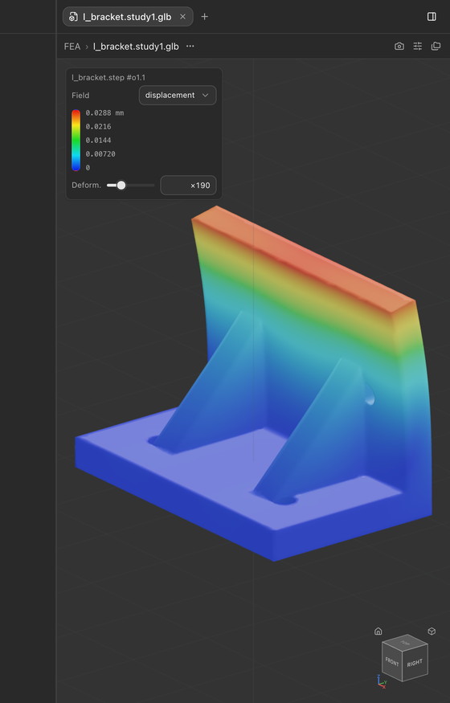
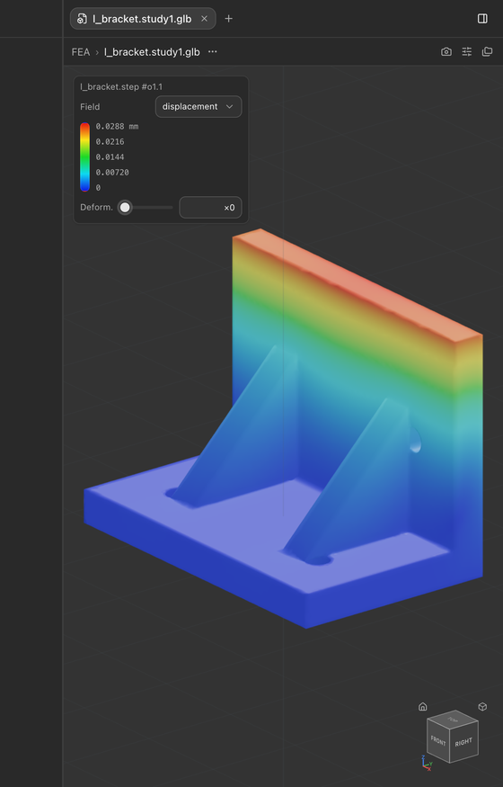
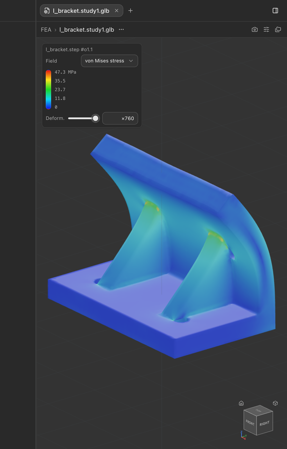
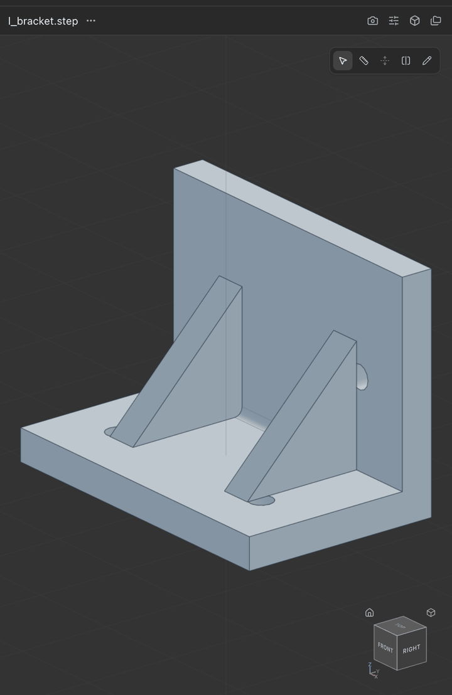
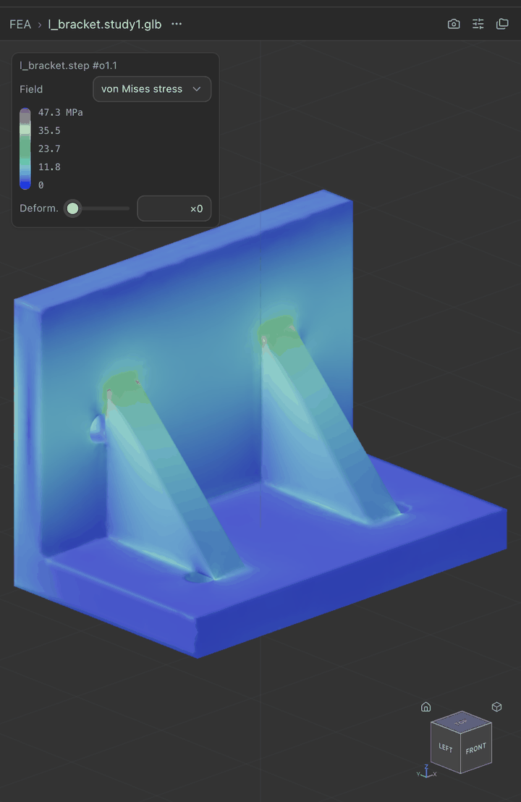

# FEA in Hardcore: research and recommendation

Status: research, September 25 2026. Branch `amy/fea-research` (worktree off
`claude/desktop-app` at fb153467). Nothing here is committed or wired into the app.
The throwaway spike lives in the gitignored `tmp/fea-spike/` of that worktree.

## Implementation status (September 25 2026, later the same day)

Phase 1 is built on this branch, uncommitted: `cadgen fea faces` and
`cadgen fea solve` (`packages/cadgen/src/cadgen/fea.py`, mechanism in
`packages/cadgen/src/cadgen/_internal/fea/`), the `cadgen[fea]` extra, the
`skills/fea` skill, the bundler's data-file restore and FEA probe
(`apps/desktop/scripts/bundle-runtime.mjs`), the extras-aware constraints
closure (`apps/desktop/scripts/cad-resources.mjs`), and
`tests/python/packages/cadgen/test_fea.py`, whose cantilever case checks the
solver against beam theory.

Phase 2 followed the same day: `packages/ui/src/renderers/glb/feaResult.js`
reads the result out of the loaded GLB (its `fields` extras and the
`_VON_MISES` / `_DISPLACEMENT` attributes), recolours by field and re-scales
the deformation in place; `FeaLegend.jsx` is the overlay (colour bar, range,
units, field select, deformation slider) on the shell's `viewportOverlay`
slot; `GlbRenderer.jsx` wires it and keeps the choice per tab. The GLB is
now standard glTF (metres, Y-up). What remains of the plan is below,
unchanged.

The built app on the L-bracket example (`models/examples/src/l_bracket.py`,
6061-T6, bottom face fixed, 500 N in −Y on the top of the back plate):

| The STEP | von Mises, deformation ×190 | Displacement field |
| --- | --- | --- |
|  |  |  |

| Deformation ×0 | Deformation ×760 |
| --- | --- |
|  |  |





## Recommendation in one paragraph

Ship linear static stress as a cadgen command backed by **netgen-mesher** (LGPL-2.1,
quadratic tets straight from the B-rep) and **scikit-fem + pyamg** (BSD-3 and MIT; assembly
and an algebraic multigrid solve), all installed from PyPI wheels into the bundled runtime
for about 35 MB per target. The command takes a STEP, a material, fixed faces and loaded
faces as the viewer's own `#o1.fN` selectors, and writes a vertex-coloured GLB that the
existing GLB renderer already displays, plus a JSON sidecar with the numbers and the
legend range. An `fea` skill teaches the agent to set up the study and to sanity-check the
answer. The spike proves the chain end to end on the repo's L-bracket with both meshers and
matches a cantilever hand calculation to about 1 percent. gmsh is the better-known mesher
but is GPL-2 with no API exception and its authors say closed-source integration needs a
commercial licence, so it is the option only if Jake wants to buy one. CalculiX is the
stronger solver but ships no PyPI binary, so it would break the wheels-only rule; the
file formats proposed here are chosen so it can replace scikit-fem later without changing
the skill or the viewer. Two bundler facts found on the way must be handled or the feature
silently fails in the packaged app: `pip install --target` drops the shared libraries both
meshers carry as wheel data files, and netgen loads its own OpenCascade with RTLD_GLOBAL.

## Solver options at a glance

Wheel availability was checked on September 25 2026 with `pip download --only-binary=:all:
--python-version 3.13 --platform <tag>` for the four runtime targets and against the PyPI
JSON API. "Size" is the compressed wheel; numpy and scipy are already in the bundle through
scikit-learn, so they are not counted.

| Solver | PyPI package | cp313 wheels (mac-arm64 / mac-x64 / win / linux) | Size added | Licence | Closed-app verdict | 3D linear static maturity |
| --- | --- | --- | --- | --- | --- | --- |
| **scikit-fem** 12.0.2 | `scikit-fem` | yes / yes / yes / yes (pure Python) | 0.2 MB, + pyamg 1.8 MB | BSD-3-Clause | fine | Building blocks: TetP2, elasticity forms, facet loads, projection. You write the BC and post layer (the spike is that layer, ~250 lines) |
| CalculiX 2.23 (ccx) | none; only pure-Python drivers (`pyccx` BSD-2, `ccx2paraview` GPL-3) | no binary on PyPI at all. conda-forge has all 4 (~3 MB each); OmnibusCloud GitHub builds win/linux/mac-arm64, no mac-x64 | 3 MB (SPOOLES) or 240–280 MB (MKL PARDISO) | GPL-2.0-or-later | fine only as a separate process exchanging .inp/.frd files, with GPL notice and source offer (how PrePoMax, FreeCAD, Mecway ship it) | Highest: C3D10, pressure and nodal loads, nodally averaged stress, decades of validation |
| SfePy 2026.2 | `sfepy` | no / no / no / no, sdist only, needs a C compiler | n/a | BSD-3-Clause | fine | Very good (P2 tets, tractions, von Mises helper), but we would have to build 4 wheels ourselves and its deps pull pyvista and vtk |
| FEniCSx / dolfinx 0.11 | not on PyPI; community `dolfinx-solver-real` | no / no / no / linux only (`cp312-abi3-manylinux_2_34`) | 58 MB + mpich | LGPL-3.0-or-later | LGPL fine, but | Excellent, and unusable here: needs a C compiler at run time for its JIT |
| FElupe 11.1.1 | `felupe` | yes / yes / yes / yes (pure Python) | 0.4 MB | GPL-3.0-or-later | importing it makes our Python a GPL combined work; would need its own GPL subprocess, at which point ccx is better | Nicest API of the pure-Python options (quadratic tets, pressure bodies, von Mises) |
| Elmer FEM | none | none | n/a | GPL-2.0 modules, LGPL core; the elasticity solver is a GPL module | subprocess only, no pip, no conda | good, skip |
| code_aster 18 | none | none, conda-forge linux and win only, multi-GB | n/a | GPL-3.0-only | subprocess only | very high, skip |
| GetFEM 5.4 | none (names registered, no releases) | none | n/a | LGPL-3.0-or-later | fine | good, skip |
| torch-fem 0.12 | `torch-fem` | yes / **no** (no torch wheel for Intel Mac) / yes / yes | 3 MB + torch 124–555 MB | MIT | fine | Tetra2 elasticity; skip on size and the missing target |
| PyMFEM 4.10 | `mfem` | yes / **no** / **no** / yes | 35–102 MB | BSD-3-Clause | fine | mature C++, two targets missing |
| nutils 9.2 | `nutils` | yes ×4 (pure Python) | 0.3 MB | MIT | fine | research code, gmsh import, elasticity example; scikit-fem is simpler |
| jax-fem, pyfem, SolidsPy, pycalculix, Sparselizard | various | mixed | | GPL-3 / Apache / MIT / GPL-2 | | research-grade, 2D only, or no wheels; skip |

Sparse solvers: `pyamg` 5.3.0 (MIT) has cp313 wheels on all four targets. `pypardiso` needs
Intel MKL, which has no Apple silicon wheel. `scikit-umfpack`, `scikit-sparse`,
`python-mumps`, `petsc4py` are sdist only. So pyamg is the one accelerator that fits the
wheel rule, and the spike shows it is enough.


## Mesher options at a glance

| Mesher | PyPI package | cp313 wheels (mac-arm64 / mac-x64 / win / linux) | Size added | Licence | Closed-app verdict | 10-node tets | Face identity from the B-rep |
| --- | --- | --- | --- | --- | --- | --- | --- |
| **netgen** 6.2.2607 | `netgen-mesher` + `netgen-occt` 7.8.1 | yes / yes (universal2) / yes / yes | 8–11 MB + 19–26 MB OCCT | LGPL-2.1-only (OCCT: LGPL-2.1 with exception) | fine: unmodified, dynamically linked, ship the notices | yes, `mesh.SecondOrder()` | yes: `geo.faces[i]` is explorer order, boundary elements carry the face index; faces can be named |
| gmsh 4.15.2 | `gmsh` | yes / yes / yes / yes | 36–42 MB (80 MB on disk) | GPL-2.0-or-later with the Gmsh exception (only for gmsh's own use of OCC, Netgen, METIS, ParaView) | no for in-process use through ctypes; authors: "integrate parts of Gmsh into a closed-source software … you will need to obtain a different license" | yes | yes: surface tag N is explorer order; physical groups per face |
| ngsolve 6.2.2607 | `ngsolve` | yes ×4 | 16–48 MB (+13 MB OpenBLAS on win and linux) | LGPL-2.1-only | fine | uses netgen | inherits netgen's names (`ds("load")`) |
| tetgen 0.8.4 (pyvista) | `tetgen` | yes ×4 (`cp312-abi3`) | 0.4 MB | wrapper MIT, TetGen core AGPL-3 (WIAS dual licence) | no without a WIAS licence | yes | only through a watertight surface triangulation you build yourself |
| fTetWild | `pytetwild`, `wildmeshing` | 3 of 4 each (no Intel Mac; no Windows) | 2–4 MB | MPL-2.0 | fine | no | no, envelope-based, surface only approximated |
| CGAL | `pygalmesh` | none, sdist only | | GPL-3 | no | limited | no |
| MMG | `mmgpy`, `pymmg` | 3 of 4 / 4 | 1–10 MB | wrapper MIT, MMG LGPL-3 | fine | no | remesher only, needs an existing mesh |
| pygmsh 7.1 | `pygmsh` | pure Python over gmsh | | GPL-3 | no | via gmsh | via gmsh |
| OCP `BRepMesh` (bundled) | `cadquery-ocp` | yes ×4 | 0 | Apache-2 / LGPL | fine | surface triangulation only, no volume mesh | trivial |


## 1. What exists in the repo today

There is no FEA or CAE code. What exists is the scaffolding an FEA feature would sit on.

- The README claims "agent skills for CAD, CAE and CAM" (`README.md:16`) and "simulation"
  (`README.md:66`). The only simulation meant is robot description (SDF). No skill, script
  or test mentions gmsh, CalculiX, scikit-fem, von Mises, yield or safety factor.
- Materials are appearance only: `materials=` on `@step` and `cadgen step build --materials`
  carry base colour, roughness and metalness (`skills/cad/references/step-generation.md:114`,
  `packages/cadgen/src/cadgen/_internal/step_reemit.py:83`). There is no density, modulus or
  yield anywhere. The one physical property is `mass_properties()` in
  `packages/cadgen/src/cadgen/geometry.py:311`.
- The render pipeline already treats a GLB's `COLOR_0` as a source colour and renders it on
  a white base so "an FEA result or scan heatmap keeps its colors"
  (`packages/core/docs/render-pipeline.md:336`), and a regression test named for the FEA ramp
  protects it (`packages/core/src/lib/render/glbMeshData.test.js:569`). Someone planned for
  this output format already.
- `skills/dfm` is not on `claude/desktop-app`. It exists on `main` and on
  `amy/geometry-annotations`. It is the closest template for an `fea` skill: one reference
  document per analysis type plus a fact-only script that prints JSON.
- cadgen's only tessellator is JavaScript (`packages/core/src/lib/surf/tessellate.js`, called
  from `packages/cadgen/src/cadgen/_internal/tessellation.py`). There is no Python surface
  or volume mesher.

## 2. Face identity: the piece that makes loads and fixtures work

The viewer's Select tool names a face as `#o1.f17` (occurrence 1, face 17). The ordinal is
the 1-based position in OCC's `TopExp::MapShapes(TopAbs_FACE)` map
(`packages/cadgen/src/cadgen/_internal/entity_ordinals.py:21`), and the chat sends it as a
`cad-selector` prompt reference, rendered as `l_bracket.step#o1.f17`
(`packages/core/src/prompt/types.ts:2`, `packages/core/src/prompt/index.js:82`). Python
resolves it back to the exact B-rep face with `read_scene(path).resolve("#o1.f17").shape()`
(`packages/cadgen/src/cadgen/step_scene.py:170`).

The spike checked whether gmsh numbers faces the same way. After
`gmsh.model.occ.importShapes(step)`, gmsh surface tag N equalled cadgen's face ordinal N for
all 23 faces of `l_bracket.step` and all 6 faces of the cantilever, compared by area and
centre of mass. Both go through the same OCC STEP reader and the same explorer traversal,
so this is expected, but it is not a contract either side documents. The command must
therefore verify the mapping rather than assume it: for each face referenced by a load or
fixture, compare area and centre of mass between the resolved OCP face and the gmsh
surface, and fall back to a nearest-match search when they differ. For assemblies gmsh
tags run across every solid it imported, so the check is also what makes multi-solid
files safe later.

netgen behaves the same way: `OCCGeometry(step).faces` came out in cadgen's ordinal order
for all 23 faces, and every boundary element carries its face index, so a face's node set is
one array filter. The research agent's experiment on a 17-face part with holes, fillets and
a chamfer gave the same result for both meshers, from both STEP and BREP.

Prefer handing the mesher a BREP written from the in-memory OCP shape rather than the
original STEP: the app's OCP already decided the topology the user is looking at, and
netgen's OpenCascade is a different version (7.8.1 against OCP's 7.9.3) whose STEP reader
could in principle split faces differently. OCP's BREP V3 output reads cleanly in netgen.
Either way the area-and-centre check stays; order is the fast path, the fingerprint is the
contract.

## 3. The spike

`tmp/fea-spike/fea_spike.py` in the worktree, run with the repo `.venv` (Python 3.12;
gmsh 4.15.2, scikit-fem 12.0.2, meshio 5.3.5 and pyamg 5.3.0 were added to it for this).

Chain: build123d or STEP → gmsh (one physical group per B-rep face, order 2 tets, Netgen
optimiser) → meshio → scikit-fem `MeshTet2` with `ElementVector(ElementTetP2)` → clamp the
fixed faces' DOFs, integrate a uniform traction over the loaded face → solve → stress at
quadrature points → von Mises → L2 projection to nodes → VTU, vertex-coloured GLB and a JSON
sidecar.

Cantilever 100 × 10 × 10 mm steel, 200 N at the free end, fixed face at x = 0:

| Quantity | Hand calculation | FE | Error |
| --- | --- | --- | --- |
| Tip deflection (Timoshenko) | 0.4031 mm | 0.4002 mm | −0.7 % |
| Bending stress at x = 25 mm | 90.0 MPa | 91.3 MPa | +1.4 % |
| Root bending stress (Euler) | 120 MPa | 128 MPa nodal, 138 MPa at Gauss points | clamp stress concentration, expected |

Mesh 2 mm, 6.5 k tets, 34 k DOF; mesh 0.3 s, assembly 1.1 s, direct solve 1.8 s, 6.7 s wall
including STEP export and two gmsh imports.

L-bracket (`models/examples/src/l_bracket.py`, 6061 aluminium, bottom face `#o1.f17` fixed,
500 N in −Y on the top of the back plate `#o1.f22`):

| | |
| --- | --- |
| Mesh 2.5 mm | 27 k tets, 45.6 k nodes, 137 k DOF, 1.0 s |
| Max von Mises | 35 MPa nodal (39 MPa at Gauss points), safety factor 7.8 on 276 MPa yield |
| Max displacement | 0.029 mm |
| Solve, SciPy SuperLU | 38.5 s |
| Solve, pyamg smoothed aggregation + CG, rigid-body near-nullspace | 4.9 s, 89 iterations, agrees with LU to 4e-11 |
| Solve, plain CG | 15.2 s |

The same bracket through netgen instead of gmsh (`OCCGeometry`, `maxh=2.5`, `SecondOrder()`,
boundary elements filtered by face index, then the same scikit-fem solve): 30.7 k tets in
0.76 s, 149 k DOF, max displacement 0.0287 mm against 0.0288 mm on the gmsh mesh. The
Gauss-point von Mises peak differed (59 against 39 MPa) because it sits on the singular edge
of the clamped face and depends on which element lands there; see the accuracy risk below.
netgen was loaded after OCP in the same process without trouble.

Three findings from the spike that change the plan:

1. **SciPy's direct solver is too slow for real parts.** SuperLU is not a 3D-capable
   sparse solver. pyamg (MIT, wheels on all four targets, 1.8 MB) brings a 137 k DOF solve
   to 5 s. That is why pyamg is in the recommendation and not optional.
2. **`pip install --target` drops both meshers' shared libraries.** Details and the fix are
   in section 5 under "Bundler consequences". Cheap to fix, fatal if missed, and exactly the
   class of bug the bundler's probe exists to catch.
3. **netgen loads its OpenCascade with RTLD_GLOBAL**, so import cadgen (OCP) before netgen
   and test on Linux and Windows. Section 5 has the reasoning.

Also checked: skfem 12's meshio loader does not pick up triangle6 physical groups for a
tetra10 mesh (it looks for `triangle`), and it renumbers nodes on load. The spike rebuilds
the face → facet map itself by coordinates. The real command should skip meshio and build
`MeshTet2` from the mesher's arrays directly (netgen's `Coordinates()`, `Elements3D()` and
`Elements2D()` with their face index), which also removes meshio and rich from the
dependency list. Mind the tet10 mid-edge node order: skfem's edge order differs from
gmsh's and netgen's in the last two edges, which the meshio path handles today.

## 4. Solvers in detail

**scikit-fem** (BSD-3-Clause, https://github.com/kinnala/scikit-fem, `scikit_fem-12.0.2-py3-none-any.whl`).
`ElementTetP2` (10-node tets), `ElementVector`, `skfem.models.elasticity.linear_elasticity`
and `lame_parameters`, `FacetBasis` for tractions and pressure, `condense` for fixed DOFs,
`Basis.project` for stress recovery. Its own README benchmark shows SuperLU at 62 s for a
64 k scalar DOF 3D Laplace, which is why a direct scipy solve does not survive contact with
a real part and pyamg is mandatory. What it does not give you: a study description, load
and fixture semantics, nodal averaging, reaction forces, or any validation. That is the
layer cadgen would own, and the spike is a first draft of it. It also means we control the
numerics end to end and can unit test them against closed-form answers.

**pyamg** (MIT, https://github.com/pyamg/pyamg, cp313 wheels on all four targets). Smoothed
aggregation with the six rigid-body modes as the near-nullspace, CG accelerated: 89
iterations and 4.9 s on the 137 k DOF bracket versus 38.5 s for SuperLU, and 20 s without
the near-nullspace. pyamg's own linear elasticity example converges in 19 iterations at
80 k unknowns.

**CalculiX** (GPL-2.0-or-later, https://www.calculix.de/). The strongest solver on the list
and the one every desktop FEA front end ships (PrePoMax, FreeCAD FEM, Mecway). It fails the
repo's packaging rule rather than the engineering: no PyPI package carries the `ccx`
binary (searched the whole PyPI index for calculix, ccx, feenox, sparselizard, getfem,
elmer, aster, dolfinx, sfepy). conda-forge has 2.23 for all four targets at about 3 MB
each (https://anaconda.org/conda-forge/calculix), and the `.conda` archives can be unpacked
in CI without conda, so "vendor a binary in the bundler" is possible, just outside the
wheels-only contract in `apps/desktop/resources/README.md`. Licence-wise it is the
textbook arms-length case in the GPL FAQ (fork and exec, files in and out,
https://www.gnu.org/licenses/gpl-faq.html#MereAggregation and #GPLInProprietarySystem):
ship the GPL text and a source offer for the exact build, never link it. If the product
later needs contact, plasticity, buckling or thermal coupling, this is the upgrade path,
and the study file and result files proposed below are designed so the solver behind them
can change.

**SfePy** (BSD-3-Clause, https://sfepy.org). Feature-wise it sits between the two above:
P2 tets, `dw_surface_ltr` for tractions, `get_von_mises_stress`, an Abaqus reader. Every
release from 2024.1 to 2026.2 is sdist only; `pip download --only-binary=:all:` fails on
all four targets. Building four wheels with cibuildwheel and trimming its pyvista and vtk
dependencies is real work for little gain over scikit-fem.

**FEniCSx** is out: no macOS or Windows wheel exists, the one community Linux wheel is
`cp312-abi3`, and DOLFINx JIT-compiles generated C at run time so end users would need a
compiler (https://docs.fenicsproject.org/dolfinx/main/python/generated/dolfinx.jit.html).

**FElupe** (GPL-3.0-or-later, https://felupe.readthedocs.io) has the most pleasant pure-Python
API and is a py3-none-any wheel, but `import felupe` inside the bundled interpreter makes
the Python that calls it a combined work under the FSF reading. Running it as its own GPL
process is possible but then CalculiX is the better GPL process.

Elmer, code_aster, GetFEM, Sparselizard: no pip distribution, and Elmer and code_aster are
GPL, so all four would be subprocess-only vendored binaries with worse I/O than ccx.
torch-fem and PyMFEM each miss a target (no torch or mfem wheel for Intel Mac; mfem also
misses Windows). Sources for each licence claim are in the table above and in the wheel
filenames pip resolved.


## 5. Meshers in detail, and the licence question

**netgen** (LGPL-2.1-only, https://github.com/NGSolve/netgen, wheels
`netgen_mesher-6.2.2607-cp313-cp313-macosx_10_15_universal2.whl`, `…manylinux_2_28_x86_64.whl`,
`…win_amd64.whl`, plus `netgen-occt==7.8.1` on all four). `netgen.occ.OCCGeometry(path)`
reads STEP or BREP with its own OpenCascade 7.8.1; `geo.faces` are "in order that they will
be in the mesh" (the docs' words), which is explorer first-occurrence order, and each 2D
element carries `index`, the 1-based face number. `GenerateMesh(maxh=…)` then
`SecondOrder()` gives 10-node tets. Names go on the shape's faces before the geometry is
built, not after (verified gotcha: `geo.faces[k].name = …` after construction does not reach
the mesh; set it on `OCCGeometry(path).shape.faces[k]` and rebuild). It cannot take an OCP
shape object directly, as the two pybind11 OCC builds are foreign to each other; a BREP file
is the hand-off, and OCP 7.9.3's BREP V3 reads correctly in netgen's 7.8.1.
On the L-bracket in the repo `.venv`: 23 faces in the same order as cadgen's ordinals,
30.7 k tets in 0.76 s, and the same displacement as the gmsh mesh to three figures.

The LGPL obligations are the usual ones: ship the LGPL-2.1 text and a notice, do not modify
the library, and keep it as separately replaceable shared objects, which the wheel layout
already is. netgen's OCCT is loaded through `ctypes.CDLL(…, RTLD_GLOBAL)` in
`netgen/__init__.py`, so on Linux the OpenCascade 7.8.1 symbols enter the global scope;
OCP's own OCCT 7.9.3 libraries are auditwheel-mangled and bind at their own load time, so
importing cadgen (OCP) before netgen keeps the two apart. That order is easy to guarantee
inside `cadgen fea solve` and must be tested on Linux and Windows (verified only on macOS
here, where two-level namespaces make it a non-issue).

**gmsh** (GPL-2.0-or-later, https://gmsh.info/LICENSE.txt). The wheel ships `gmsh.py` and a
shared library that `gmsh.py:92` loads with `ctypes.CDLL`, OpenCascade 7.8 statically linked
inside it (no clash with OCP; also verified in one process with OCP and netgen). The licence
exception in the shipped `LICENSE.txt` only lets gmsh itself combine with Netgen, METIS,
OpenCascade and ParaView; it says nothing about programs that call the gmsh API. The manual's
copying conditions add: "If you want to integrate parts of Gmsh into a closed-source
software … you will need to obtain a different license. Please contact us directly"
(https://gmsh.info/doc/texinfo/gmsh.html). The FSF FAQ treats dynamic linking in a shared
address space as a combined work (https://www.gnu.org/licenses/gpl-faq.html#GPLStaticVsDynamic,
#GPLPlugins) and only fork-and-exec with arms-length communication as separate programs
(#MereAggregation, #GPLInProprietarySystem). A subprocess design is possible (the wheel has
no `gmsh` executable, so the child would be a second interpreter running a small GPL helper
that reads a BREP and writes a mesh file), but the authors' stated policy is stricter than
the FAQ, so this is counsel's call, not ours. Technically gmsh is excellent: on the same
bracket it meshed in 1.0 s with the Netgen optimiser, its surface tags matched cadgen's face
ordinals for all 23 faces, and physical groups per face are a clean identity mechanism.
Keep the `cadgen.fea.mesh` module behind a small interface so gmsh can be swapped in if a
licence is bought.

**ngsolve** (LGPL-2.1) is worth naming as the alternative solver: it pairs with netgen, has
`VectorH1(order=2)` elasticity with named boundaries and a BDDC preconditioner, and its
elasticity tutorial is fifteen lines (https://docu.ngsolve.org/latest/i-tutorials/wta/elasticity3D.html).
It costs 16–48 MB more than scikit-fem plus pyamg, is LGPL rather than BSD, and its results
live in its own objects, whereas the scikit-fem path is plain numpy and scipy the rest of
cadgen already depends on. Choose it if the scikit-fem layer turns out to need more than
linear statics quickly.

**tetgen** would need us to build a watertight surface triangulation face by face and its
core is AGPL. **fTetWild** and **MMG** each miss a target and do not preserve faces or make
quadratic elements. **pygalmesh** has no wheels. **pygmsh** is a GPL-3 wrapper on gmsh.
Everyone doing CAD-to-tet in Python ends up on gmsh or netgen, because they are the only
two that consume the B-rep directly with face bookkeeping.

### Bundler consequences (verified, both meshers)

`pip install --target`, which `apps/desktop/scripts/bundle-runtime.mjs:295` uses, discards a
wheel's `*.data/data/lib/` files. gmsh keeps `libgmsh.4.15.dylib` there; `netgen-occt` keeps
all of `libTK*.7.8.1.dylib` there. After a `--target` install of either, the dist-info RECORD
points at `../lib…` files that do not exist; gmsh then warns and binds nothing, and netgen
fails at import with `KeyError: 'tkernel'` because it locates the OCCT libraries through the
RECORD (`netgen/__init__.py:14-61`). The fix is one bundler step after pip: for each wheel
with a `.data/data/lib` directory, unzip those files to the path the RECORD names relative
to site-packages (which is the runtime's `lib/` directory, where a normal install puts
them), and extend the probe to `import netgen.occ` and mesh a unit cube. The same step
covers gmsh if it is ever adopted.


## 6. Proposed architecture

```
viewer Select tool ──► cad-selector refs (#o1.f17, #o1.f22) ──► chat
                                                                  │
agent + skills/fea ◄──────────────────────────────────────────────┘
   │  writes study.json, runs:
   ▼
cadgen fea solve part.step --study study.json --out FEA/part.study1
   │  cadgen.fea (Python, in the bundled runtime)
   │   1. read_scene().resolve() each face selector → OCP face (area, centre)
   │   2. write BREP of the shape; netgen OCCGeometry; verify face i ↔ ordinal i+1 by
   │      area and centre; name the used faces; maxh from bbox (default diag/40);
   │      GenerateMesh, SecondOrder
   │   3. scikit-fem: MeshTet2 from netgen arrays (nodes, tet10, face node sets from
   │      Elements2D index), TetP2 vector basis,
   │      linear_elasticity, Dirichlet on fixed faces, traction on loaded faces
   │   4. pyamg SA + CG (fallback SuperLU under ~30 k DOF)
   │   5. post: von Mises at Gauss points → nodal, displacement, reaction check
   ▼
FEA/part.study1.glb   boundary triangles, COLOR_0 = von Mises ramp, deformed × scale,
                      glTF extras {field, units, min, max, scale}
FEA/part.study1.json  {inputs echoed, max_von_mises, max_displacement, safety_factor,
                       reaction_forces, mesh stats, timings, warnings}
FEA/part.study1.vtu   optional, for ParaView and for later probes
   │
   ▼
viewer GLB renderer shows the colour map today (COLOR_0 already renders on a white base);
a legend overlay reads the extras / sidecar (ShellViewport children slot).
```

### The cadgen command

`cadgen fea solve IN.step [OUT] --study study.json [--mesh-size mm] [--json]`, a module
`cadgen/cli/fea_solve.py` in the `_COMMANDS` registry
(`packages/cadgen/src/cadgen/cli/__init__.py:35`), generated from a function signature like
the other doors (`_internal/cli_from_function.py`). Because the generated parser only
takes scalars and paths, the study is a JSON file rather than repeated flags:

```json
{
  "material": {"name": "6061-T6", "E_MPa": 68900, "nu": 0.33, "yield_MPa": 276},
  "fixtures": [{"faces": ["#o1.f17"], "type": "fixed"}],
  "loads": [{"faces": ["#o1.f22"], "type": "force", "vector_N": [0, -500, 0]}],
  "mesh": {"size_mm": 2.5, "order": 2},
  "output": {"deformation_scale": "auto"}
}
```

Result dataclass in `results.py` style: `FeaResult(ok, files, summary, warnings)` so
`--json` prints one line the agent can read. The solve is CPU-bound Python and numpy, so
it can run in the agent's shell like `stl build` does today. Making it a `_WARM_COMMANDS`
daemon job (`cli/__init__.py:125`) saves the OCP import but not the solve time; defer.

Materials: a small table inside cadgen (steel, 6061, 7075, 304, ABS, PLA, nylon, titanium)
with E, ν, density and yield, plus the free-form override above. The existing appearance
materials stay separate; do not overload them.

### The skill

`skills/fea/SKILL.md` on the dfm pattern: when to run a study, how to pick faces (ask the
user to select in the viewer, or resolve by description with the inspection tools), the
`study.json` schema, the material table, and what to report. `references/linear-static.md`
carries the checklist an engineer runs: units are mm, N, MPa; one fixed face plus one load
is the minimum; a fully fixed face over-stiffens and concentrates stress at its edge, so
report the max away from the fixture too; refine the mesh once and confirm the peak moves
less than 10 percent; compare to a beam or plate formula when the geometry allows; give
safety factor against yield and say when it is below 2. `references/materials.md` lists the
table. The skill requires `cadgen[fea]==<VERSION>`.

### Results in the viewer

- MVP: the GLB renderer as it is. Vertex colours render (`packages/core/src/lib/render/glbMeshData.js:446`), and the deformed shape is baked into the vertex positions. The
  agent opens the GLB with `open_file` and quotes the numbers from the sidecar.
- Next: a legend and a "deformation × N" readout as a renderer-owned overlay in the
  `ShellViewport` children slot (`packages/ui/src/renderers/kit/shell/ShellViewport.jsx:117`),
  fed by glTF `extras` on the mesh (no new file format, no IPC).
- Later: a dedicated `fea` renderer keyed on the sidecar, with field switching (von Mises,
  displacement, principal), a deformation slider, and picking that reads the value under
  the cursor from a `_VALUE` attribute. The GLB renderer declines selection today
  (`packages/ui/src/renderers/glb/index.ts:14`).

Why GLB plus JSON rather than VTU: the app renders GLB and nothing renders VTU; VTU is the
right archival and ParaView format, so write it as an optional third file. Writing values
into a custom `_VON_MISES` float attribute alongside `COLOR_0` keeps the GLB self-describing
for the later renderer at no cost now.

## 7. UX: "fix this face, push 200 N on that face"

Two paths, and both should work from day one because they land on the same selector.

1. **Select tool.** The user picks the base's bottom face and the back plate's top face,
   which arrive in the composer as `l_bracket.step#o1.f17` and `#o1.f22` chips, and types
   "fix the first, 200 N down on the second, 6061". The agent writes the study with those
   selectors. This is the same `cad-selector` reference the annotations branch builds on;
   nothing new is needed in the composer.
2. **Plain language.** "Fix the mounting face and hang 200 N off the top of the upright."
   The agent resolves faces with the inspection tools it already has (`read_scene`, face
   areas, normals, positions from the cad skill) and, when ambiguous, answers with the
   candidates as selector chips and asks. A `cadgen fea faces IN.step` helper that lists
   faces with area, normal, centre and a plain-language hint ("largest planar face, normal
   −Z, at z = 0") makes this reliable.

Direction, magnitude and units come from the text. The skill should insist on N and mm and
restate what it applied ("500 N total, spread as 0.78 MPa over face 22, 640 mm²") so a wrong
face is visible before the solve runs.

## 8. Risks and unknowns

- **Licences.** netgen (LGPL) is shippable with notices. gmsh in-process is not, without a
  commercial licence; section 5 has the reading and the sources. Any change to that
  position is Jake's call, not an engineering question.
- **Two OpenCascades in one process.** netgen brings OCCT 7.8.1 next to OCP's 7.9.3 and
  loads it RTLD_GLOBAL. Worked on macOS; needs a Linux and Windows run of the bundle probe
  before anyone relies on it. The fallback is running the mesh step in a child interpreter
  that never imports OCP, with the BREP as input, which the design already allows.
- **Accuracy.** Linear static with quadratic tets is the industry baseline and the spike
  matched beam theory to about 1 percent. The known traps are the ones any FEA tool has:
  singular stress at a clamped edge or a re-entrant corner (values rise with mesh
  refinement and never converge), nodal averaging hiding a peak, and Poisson stiffening of
  a fully fixed face. Mitigate with a refine-once check in the skill, reporting both the
  Gauss-point and nodal maxima, and a validation suite: the cantilever, a plate with a hole
  (Kt ≈ 3), and a pressurised thick cylinder, each with a hand answer, run in the Python
  tests on tiny meshes.
- **Run time.** Mesh 1 s, assembly 5 s, solve 5 s at 137 k DOF on an M-series Mac. The
  default mesh size must be chosen from the bounding box so a typical part lands at 30–80 k
  DOF, with a cap and a warning above about 300 k. Assembly is pure numpy and could be cut
  further with a lower quadrature order; the solve scales roughly linearly with pyamg.
- **Bundle size.** netgen-mesher 8–11 MB plus netgen-occt 19–26 MB compressed, pyamg 2 MB,
  scikit-fem 0.2 MB: roughly 30–40 MB per target compressed. scipy and numpy are already in
  the closure via scikit-learn. (gmsh would be 36–42 MB compressed, 80 MB on disk.)
- **Wheel tags.** netgen-mesher's Linux wheel is `manylinux_2_27.manylinux_2_28`, and
  netgen-occt's is `manylinux_2_17`; both are in the runtime's tag list
  (`apps/desktop/scripts/python-build.json:40-44`). The macOS wheel is universal2 with a
  10.15 floor, under the runtime's 11.0 and 12.0 floors. Windows is `win_amd64`.
- **The `--target` data-file drop** in section 5. Cheap to fix, fatal if missed.
- **Failure modes to design for:** gmsh failing to mesh a bad STEP (tiny sliver faces,
  non-manifold), a load face that is not on the boundary of the meshed solid (assembly
  files), a study with no fixture (singular matrix; catch the pyamg non-convergence and say
  so), a face that no longer exists after the model was edited (selector ordinals shift
  when topology changes, the same problem annotations have).
- **Constraints closure.** Only packages in cadgen's dependency closure get pinned and
  bundled (`apps/desktop/scripts/cad-resources.mjs:104`). The FEA packages must be a cadgen
  extra that the desktop build installs, not a skill `requirements.txt`, which is never
  installed into the runtime.

## 9. Phased plan

**Phase 0, decisions (this week).** Licence position on gmsh; agree the study JSON and the
result files; agree the `cadgen[fea]` extra.

**Phase 1, MVP: linear static on a single part.**
- `cadgen fea solve` and `cadgen fea faces`, `cadgen/fea/` package (mesh, solve, post,
  materials), `MeshTet2` built directly from netgen arrays, the mesher behind a small
  interface so gmsh can be swapped in.
- Bundler step for wheel data-file libraries; probe imports netgen.occ and pyamg and
  meshes a unit cube; Linux and Windows runs of that probe.
- `skills/fea` with the linear-static reference and material table.
- Outputs: GLB with `COLOR_0` and `_VON_MISES`, JSON sidecar, optional VTU.
- Tests: cantilever, plate with hole, thick cylinder against hand values; face-mapping
  test on a multi-face part; bundle probe.

**Phase 2, viewer.** Legend and deformation readout as a GLB renderer overlay from glTF
extras; field switch (von Mises, displacement magnitude).

**Phase 3, breadth.** Pressure loads, remote loads and bearing loads, symmetry constraints,
multiple load cases, an assembly with bonded contact (gmsh meshes the fused solid; parts
keep separate materials by volume physical group), modal analysis (scikit-fem plus scipy
`eigsh`; the mass matrix is one more form), thermal.

**Phase 4, dedicated FEA renderer** with probing and a results panel, if usage justifies it.

## 10. Open questions

For Jake:
- netgen (LGPL, with notices) is the proposed mesher. Is a gmsh commercial licence worth
  pursuing instead, given gmsh's wider adoption and its robustness on bad STEP files?
- Is a vendored CalculiX binary (GPL, separate process, about 3 MB per target from
  conda-forge) an acceptable exception to the wheels-only rule later, when the solver
  needs contact or plasticity, or does the runtime stay pip-only for good?
- Should `cadgen` on PyPI carry the `fea` extra (so skills outside the app can use it) or is
  this a desktop-only addition?
- Is the bundle growing by roughly 35 MB compressed per target acceptable?

For Amy:
- Keep `#o1.fN` ordinals as the load and fixture identity, or move to the geometric
  signatures the annotations branch is heading toward (area, centre, normal), which would
  survive a model edit? Both can be stored; the ordinal is fast and the signature is the
  check.
- Should the first cut solve in the agent's shell (simple, blocks the agent's turn) or as
  a daemon job with progress in the explorer?

## 11. Relation to the annotations work

The annotations branch (`amy/geometry-annotations`) builds selection and inspection on the
same `cad-selector` reference shape, and the selector grammar is shared across
`packages/cadgen/src/cadgen/cad_ref_syntax.py`, `packages/core/src/lib/cadRefs.js` and
`apps/desktop/src/shared/cad-refs.ts`. A load or a fixture is an annotation on a face with
a payload (a vector, or "fixed"), so the study file above is a natural client of whatever
persistent reference record that branch settles on. The one requirement FEA adds is that
a reference resolves to a face that can be matched geometrically after the topology
changes, because a study will be re-run after the model is edited; that is the same
requirement annotations have, so solving it once serves both.
