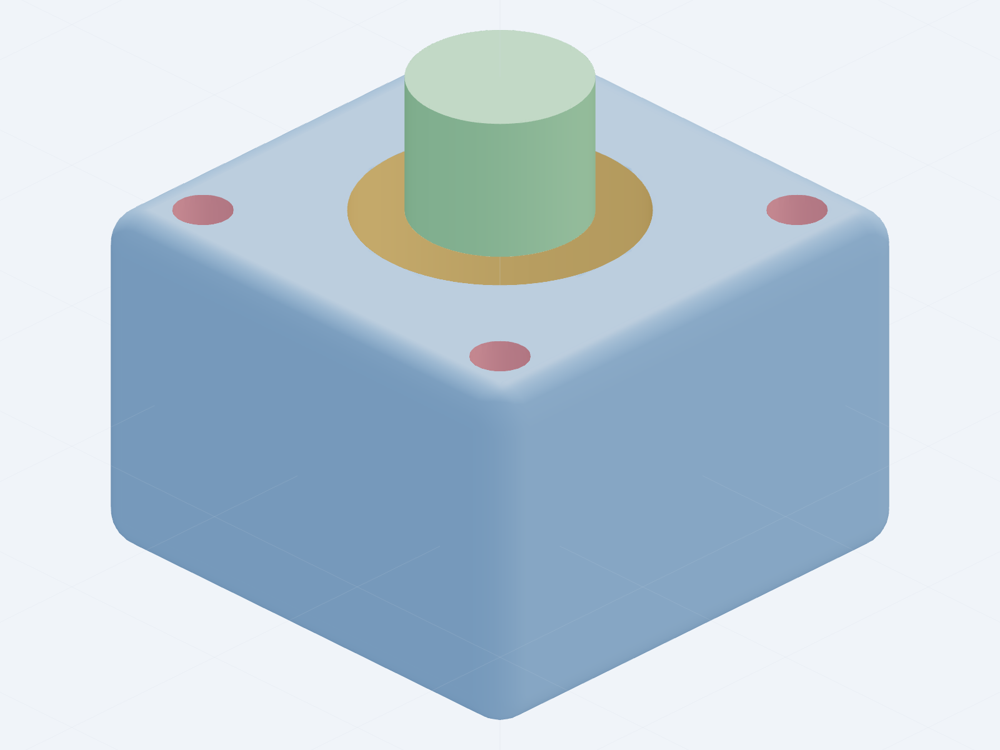
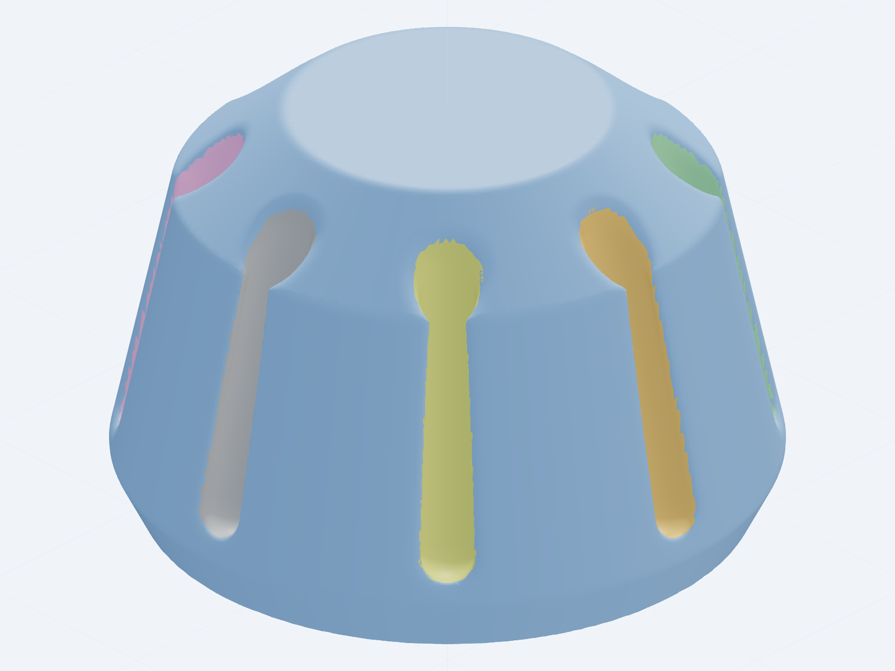
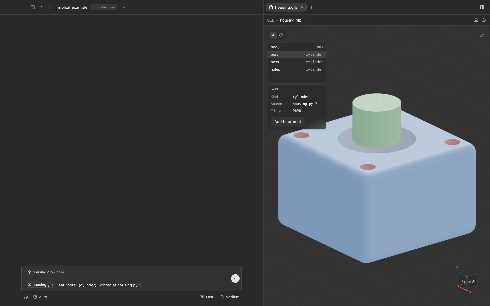
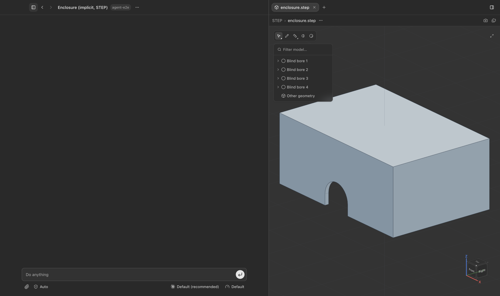
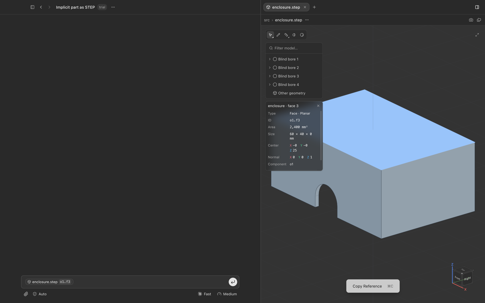
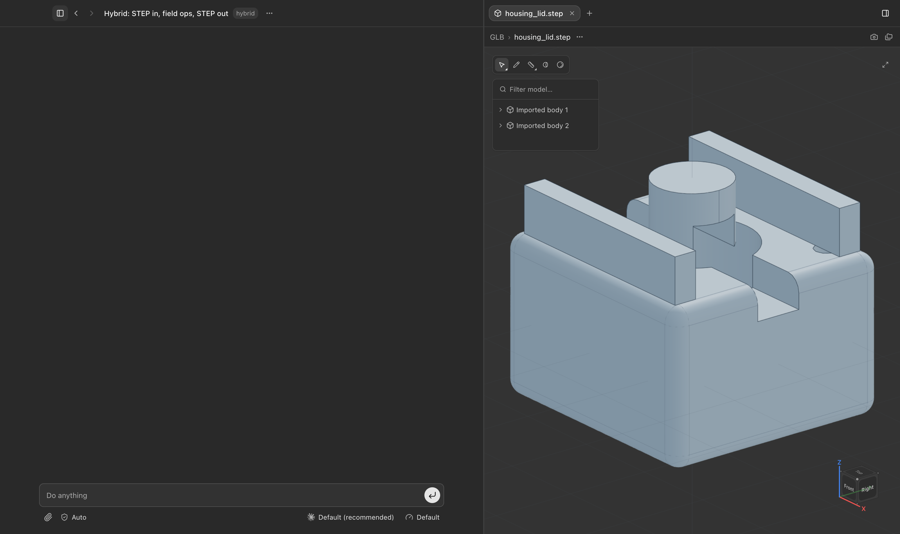

# Implicits in Hardcore: parts as signed distance fields

Branch `amy/implicits` (off `origin/claude/desktop-app`), September 26 2026.
Status: built and tested; not merged. The engine lives in `cadgen` (Python,
numpy only) with a skill; the viewer change is confined to the GLB renderer
and its scene, and only for GLBs an implicit part wrote.

## What was built

An agent can now model a part as a **signed distance field** instead of a
B-rep: every shape is a function from a point to its signed distance,
booleans are `min`/`max`, fillets, shells and offsets are numbers added to
the field. The part is meshed by contouring and written as GLB/STL, which
the FileViewer already renders. Every mesh vertex knows the primitive in
the author's code that made it, so the GLB carries one named node per
primitive: the "annotated field" from Blake Courter's Omega writeup, at the
level of leaves.

| Piece | Where | What |
| --- | --- | --- |
| Engine | `packages/cadgen/src/cadgen/_internal/implicit/field.py` | The expression tree: 10 primitives (sphere, box, cylinder, capsule, cone, torus, half space, extrude, revolve, custom), 4 profiles (circle, rect, polygon, regular polygon), booleans with `round`/`chamfer` blends, translate/rotate/scale/mirror/repeat/elongate, offset/shell/round. Each node evaluates `(distance, owning leaf)` for a batch of points and carries conservative bounds. Every leaf records the `file:line` that wrote it. |
| Mesher | `.../_internal/implicit/mesh.py` | Surface nets with dual-contouring vertex placement (a per-cell least-squares against the crossing normals, which the field gives exactly), Newton projection onto the surface, gradient normals, crease splitting. Chunked sampling; refuses grids over 40M samples with the resolution that would fit. |
| Writers | `.../_internal/implicit/writers.py` | Binary STL; Y-up GLB with one node, mesh and material per leaf, `cadUpAxis`/`cadUnits`/`cadSourceKind` extras the viewer's loader reads, plus `implicitLeaf`/`implicitSite` extras. |
| Tape | `.../_internal/implicit/tape.py` | `<stem>.implicit.json`: the tree as data plus bounds, resolution and the leaf table. A saved part re-meshes and measures without its source (the same independence law a STEP has). |
| Questions | `.../_internal/implicit/measure.py` | `probe`, `measure` (bounds, volume, area, centroid, per-leaf surface), `clearance`, `interference`, `thickness` (inward sphere-traced rays: min, 5th percentile, median; plus largest inscribed sphere). |
| B-rep bridge | `.../_internal/implicit/brep.py` | The tree as a build123d shape: every primitive (box and cylinder rounds become fillets), booleans, translate/rotate/scale/mirror/repeat, offset and shell (OCC's ARC offset, then INTERSECTION as the fallback it suggests). A boolean's `round`/`chamfer` becomes an OCC fillet or chamfer on the edges that boolean created (found geometrically: edges lying on two operands' surfaces); a refused fillet is retried at half, quarter and eighth radius, then per tool, then left sharp with a warning naming the join. `elongate` and `custom` are refused. Twelve exact-subset shapes match their meshes to within 0.4 %. |
| Authoring | `.../_internal/implicit/authoring.py`, `cadgen/implicit.py` | `@im.part(out=..., resolution=...)`: declares; a top-level call writes the meshes and tape; a call inside another part composes. Script argv takes `--resolution`, `--json`, `--verbose`. The public namespace holds the DSL and two verbs. |
| CLI | `cadgen/cli/implicit_build.py`, `implicit_measure.py`, `implicit_faces.py` | Generated mirrors: `cadgen implicit build TAPE [OUT]` (STEP, GLB or STL by suffix; `--blends fillet|drop|refuse`, `--resolution`), `cadgen implicit measure TAPE --walls --at x,y,z`, `cadgen implicit faces STEP --ref part.step#o1.f7`. `im.to_brep(field)` is the library form, so a `$cad` model can compose an implicit part. |
| Viewer | `packages/core/src/lib/render/glbScene.js`, `packages/ui/src/renderers/glb/` (`tools.js`, `useLeafSelection.js`, `LeafSection.jsx`, `GlbRenderer.jsx`) | A GLB whose nodes carry `implicitLeaf` extras gets a Select tool: the scene lists `leaves`, `pick(ray)` answers with the leaf under the pointer, hover and selection paint as the robot scene's do, a Leaves panel lists the leaves, and the Reference panel's Add to prompt hands the composer the file plus one line per leaf naming its source line. A plain GLB is unchanged (its browser tests still pass). |
| Skill | `skills/implicit/` | `SKILL.md` plus `references/modeling.md`, `questions.md`, `meshing.md`; `requirements.txt` pins `cadgen[snapshot]==0.6.6`. Discovered by the desktop app's `build-skills.mjs` automatically. |
| Tests | `tests/python/packages/cadgen/test_implicit.py` (28), `tests/python/skills/implicit/`, `packages/core/src/lib/render/glbScene.test.js` (+3) | Exact distances, boolean arithmetic and leaf ownership, closed outward meshes at known volumes, GLB/STL bytes, tape round trip, decorator and composition, both verbs. |
| Docs | `README.md`, `apps/docs/src/app/page.tsx`, `packages/cadgen/README.md`, `packages/ui/docs/cad-renderer.md`, `settings-ui.md` | The skill's table row, docs card, package map entry, and the GLB renderer's contract. |

### A part

```python
from cadgen import implicit as im

@im.part(out="GLB/housing.glb", resolution=0.5)
def housing():
    body = im.box((30, 30, 20), radius=2).named("body")
    bore = im.cylinder(radius=8, height=40).named("bore")
    boss = im.cylinder(radius=5, height=8).translate(0, 0, 14).named("boss")
    holes = im.cylinder(radius=1.6, height=30).translate(11, 11, 0).mirror("x").mirror("y").named("holes")
    return im.union(body - bore, boss, round=1.5) - holes
```



The four colours are the four leaves; the GLB's nodes are `body`, `bore`,
`boss`, `holes`, each with `implicitSite: housing.py:N`.





### The same part as a B-rep

Amy's reaction to the mesh view was that implicits are less intuitive than
B-reps. So a part can now be a B-rep too: list a `.step` in `out` and the
script builds one with build123d beside the mesh, the field's blends as OCC
fillets. The viewer then shows it exactly as any STEP, with edges, the full
tool strip, face selection and references, and Hardcore's feature detection
naming what it finds (the four blind bores below are the screw holes).



Cost and limits: the B-rep build costs what a `$cad` build costs (the
enclosure went from 0.9 s to 2.7 s with its STEP), so it is opt-in per part.
OpenCascade decides what it will fillet and shell: the enclosure and the
housing translate cleanly, the cut-edge fillet on a plate works, but the
knob's shell after eight grip cuts fails in OCC with both offset kinds, the
same failure the hand-written build123d knob hit, so the knob stays mesh
only and the build result says why. The mesh is always written; the STEP is
the bonus when the kernel agrees.

Picking the bore and pressing Add to prompt puts this in the composer:

```text
GLB/housing.glb

housing.glb: leaf "bore" (cylinder), written at housing.py:7
```

The knob is `revolve(polygon)`, minus eight rotated capsules with
`round=1.2`, shelled to 1.6 mm, opened with a half space, with an extruded
hexagon subtracted through a boss. It is 277k triangles at 0.25 mm cells and
builds in 3.7 s; the housing is 54k triangles at 0.5 mm in 0.3 s.

### What measuring on the field looks like

```text
$ cadgen implicit measure GLB/knob.implicit.json --walls --at 0,0,10
knob (GLB/knob.implicit.json) at 0.25 cells:
  size 33.6 x 33.6 x 21.9, min (-16.797, -16.797, 0.9), max (16.797, 16.797, 22.8)
  volume 5388.68, surface area 6167.86, centroid (-0.000, 0.000, 11.359)
  wall thickness: min 0.0625 at [-13.55, -1.16, 0.9], 5th percentile 1.537, median 1.606, max 4.1 at [...]
  leaf 0: body (knob.py:11), surface 3266.3
  leaf 1: grips (knob.py:13), surface 250.1
  ...
  probe (0, 0, 10): distance -0 (inside), leaf 10
```

The shell is 1.6 mm and the median says so. The minimum is a knife edge
where the opening's plane cut meets the sloping wall — a real print
warning, and `min_at` says where. An earlier cut height left a 0.7 mm slab
of the shell's bottom plate, and the same line caught it.

Accuracy at the default resolution: a sphere's volume within 0.03 %, a
box's within 0.003 % with its corners exactly on the box, the lens of two
overlapping spheres within 1 %.

## Speed against the B-rep path, and the drawbacks

The same two parts written in build123d through `@step`/`@glb`
(`tmp/implicit-smoke/src/housing_brep.py`, `knob_brep.py`), timed cold on
the same machine (a fresh store):

| Part | Implicit script | build123d + STEP | Note |
| --- | --- | --- | --- |
| housing (box, bore, boss, 4 holes) | 0.29 s | 6.7 s cold, 5.8 s after one dimension change, 0.4 s no-op rerun | about 2.5 s of the B-rep time is the OpenCascade import |
| knob (revolve, 8 grips, shell, socket) | 3.7 s at 0.25 mm (277k triangles) | 6.7 s, and the shell FAILED (`offset Error`), so the part shipped solid | the field shells in one line; the B-rep needs a fallback |

The same parts with the STEP-first default (`@im.part` with no options: the
B-rep, no mesh), three fresh runs each on 27 Sep:

| Part | B-rep only | STEP-first default | Mesh-only iteration |
| --- | --- | --- | --- |
| housing | 5.69 s | 2.7 s | 0.27 s |
| enclosure | 5.80 s | 2.9 s | 0.99 s |
| knob | 6.39 s, wrong part | 9.9 s, correct mesh, no STEP | 3.5 s |

Producing a STEP means importing the kernel (2.2 s) either way; what the
field path skips is the store, the Node tessellation and the STEP re-emit.
A rerun with nothing changed favours the B-rep path (0.4 s, the store skips
the build) until the implicit export is cached by tape hash. The harness is
`scripts/bench/implicit-vs-brep/`.

Where the time goes for a field: it scales with the grid, so the knob at
0.5 mm is under a second and at 0.1 mm would be minutes. The B-rep path's
time is mostly fixed (kernel import, store, STEP write) and does not grow
with output fidelity.

Drawbacks of the implicit path, honestly:

- **The mesh is the primary output.** A STEP is built on request and only
  when OpenCascade can fillet and offset what the field did; a part it
  refuses stays mesh only, with no exact faces, feature tree or drawings.
- **Fidelity is the resolution.** A feature under about two cells vanishes;
  curved surfaces are faceted at the cell size; cost grows cubically.
- **Files are bigger.** The housing GLB is 1.4 MB against 118 KB from the
  tessellator, because a surface-nets mesh is uniform where a B-rep
  tessellation is adaptive.
- **Smooth blends are bounds, not distances.** Near a `round` join the field
  is no longer an exact distance, so offsets and thickness there are
  approximate, and the leaf boundary through a blend is settled by majority
  vote rather than geometry.
- **Measurements are sampled.** Every number is exact to a cell, and the
  thickness minimum honestly reports knife edges as thin.
- **No parameter derivatives** (cadjoint's territory), and the UI selects
  leaves, not faces.

## The simplified flow: STEP first

Amy's second reaction: it should feel like STEP, be interactive like STEP,
and be simpler. So the default changed. A part script with no options now
writes two files, `part.step` and `part.implicit.json`, and the viewer opens
the STEP as any STEP: edges, face selection, measure, the feature panel, the
right-click Add to prompt that hands the agent `part.step#o1.f3`. The field
stays underneath as the source: `cadgen implicit faces part.step --ref
part.step#o1.f3` answers that the face is `outer`, written at
`enclosure.py:30`, by evaluating the face's centre in the tape. The mesh is
no longer in the everyday path; it is one build away for printing, and the
fallback when the kernel cannot build the B-rep.

The verbs collapsed to three: `build` (a STEP, GLB or STL from the tape, by
suffix), `measure`, and `faces`. The `step` verb is gone.



```text
$ cadgen implicit faces src/enclosure.step --ref enclosure.step#o1.f3
src/enclosure.step: 1 face mapped through src/enclosure.implicit.json
  #o1.f3     plane        2400.00 mm^2  at (-0.00, -0.00, 25.00)  leaf 0: outer (enclosure.py:30)
```

What the user gets: everything the STEP view already does, plus provenance to
code for every face, plus operations that cannot fail while modelling. What
they give up: nothing in the viewer. The GLB leaf-selection panel remains for
the mesh fallback and for parts that declare a mesh.

## Combining B-reps and fields: the translator both ways

Amy's ask: build a translator between the two, run every operation through
the field, and export a B-rep. The branch now does that.

**The way in** (`_internal/implicit/brep_field.py`, `im.from_step`,
`im.from_shape`): a build123d shape becomes a leaf that answers the distance
question. The shape is tessellated once at a chord tolerance well under the
grid cell, every triangle is covered with samples at the cell spacing, a k-d
tree over the samples (scipy, already a build123d dependency) finds the
nearest sample, and the distance is the exact point-to-triangle distance to
that sample's triangle, signed by the angle-weighted pseudonormal at the
closest point (a face normal alone mis-signs points above a convex rim,
which put phantom geometry over the housing's hole edges until the
tessellation's vertices were welded and edge and vertex pseudonormals
computed). The leaf keeps the shape and rebuilds its sampler only when a
finer grid asks.

**The way out** (`brep.py`): a B-rep leaf returns its own shape, so every
boolean, transform, mirror and repeat applied to it in the field is rebuilt
with the original faces. Blends become fillets and shells become offsets as
for any tree, with the same fallbacks.

Measured on the housing STEP (34 faces):

| Step | Result |
| --- | --- |
| field accuracy at 11 probe points | within 0.02 mm of OpenCascade's exact distance (0.001 on planes and cylinders) |
| contour at 0.3 mm | volume 14903.8 vs exact 14892.8 (0.07 %), 6.8 s (a primitive tree of that size is 0.3 s; the k-d tree queries over 1.8M samples are the cost) |
| slot cut in the field, then `to_brep` | mesh 14284.7, B-rep 14285.2, 47 faces: the original 34 plus the slot's |
| shell 1.5 mm in the field | 289k triangles in 10.8 s, no kernel involved |

A hybrid demo (`tmp/hybrid/src/housing_lid.py`, ignored): the housing STEP
enters the field, two ribs are unioned on with a 1.5 mm blend, a slot is cut,
and the part leaves as GLB and STEP in 14 s. OpenCascade refused the rib
fillets, so the STEP has that join sharp and the build says so; the mesh has
the blend.



The tape records a B-rep leaf as the STEP it was read from, relative to the
tape, so a saved part stays rebuildable as long as the two stay together.

What this gives Jake's concern about selection: the model is edited in the
field, where nothing fails, and inspected on the exported STEP, where faces
and edges exist. The field view's leaf selection is for pointing the agent at
code; the STEP view is for pointing at geometry.

## Design decisions, and why

**numpy only, no new runtime dependency.** The packaged desktop runtime
installs cadgen's base dependencies and nothing a skill's `requirements.txt`
adds (`apps/desktop/scripts/bundle-runtime.mjs`, `cad-resources.mjs`).
scikit-image's marching cubes would have needed a new extra and a bundler
change, as the FEA branch needed for netgen. Surface nets need no case
table, so the mesher is 250 lines of numpy and runs wherever cadgen does.
numpy is now declared directly in `pyproject.toml` (it was transitive via
build123d).

**Not through the store.** The store, `@stl`/`@glb` and the mesh doors are
B-rep only: a mesh-only model still gets a SURF tree and the JavaScript
tessellator writes the file (`_internal/generation.py`, `mesh_export.py`).
An implicit part has no B-rep, so `@im.part` writes its files directly, as
the FEA branch writes its result GLB. What the store guarantees — a generated
file independent of its source — the tape gives instead.

**Leaves, not faces.** Omega maps selections to the leaf node that made
them. A distance field has no faces, but every point has a nearest leaf, and
that is what the per-vertex and per-triangle ownership tracks through
booleans (union keeps the smaller distance's owner, subtraction the tool's
where it wins). One GLB node per leaf is the cheapest form the viewer can
use today: the tree panel lists them, picking one shows its name.

**Dual contouring placement, not plain surface nets.** Plain surface nets
chamfer every sharp edge by a cell, which showed as a sawtooth on the
housing's rims. Solving the per-cell QEF against the crossing normals
(exact from the field) put the vertices on the edges; a 20×10×6 box meshes
to its corners within 1e-6.

**Half-space convention.** `half_space(normal, origin)` is the half the
normal points into, so `part - half_space((0,0,1), (0,0,top))` removes what
is above `top`. The first convention (outward normal) produced a disc where
a knob was expected; the reading test is "subtract the half space pointing
that way".

**`sdf` was taken.** `skills/sdf` and `cadgen sdf` are SDFormat, the
simulator XML. The skill, namespace and verb are `implicit`; the skill's
description names the difference so neither is triggered for the other.

## What it does not do yet

- **STEP when OpenCascade agrees.** Blends are now fillets and shells are
  offsets, but OCC refuses some of each (the knob's shell over eight grip
  cuts); such a part stays mesh only with a warning naming the node. A
  mesh-to-B-rep fallback (fitting faces to the contoured mesh) would give
  every part a STEP at the cost of exactness.
- **Leaf selection, not face selection.** The viewer selects a whole leaf
  (a primitive); it cannot select one face of it, since a field has none.
  The prompt gets the file and the leaf's source line, not a CAD selector.
- **No time or parameter derivatives.** Gradients are numeric, spatial only.
  Omega's temporal and parametric derivatives, and its interference proofs
  over parameter ranges, would need the tree to be differentiable.
- **Thickness is ray based.** Percentiles make it usable; a medial-axis
  distance transform on the grid would make it exact.

## Related work seen while building

- **Omega / GSL (Gradient Control Labs).** The reference for this design:
  parts as code on distance fields, unit gradient fields, the annotated
  field, booleans as math. Closed compiler; an eval license was offered.
  This branch gives Hardcore the modeling model in the open, in Python, so
  an Omega plugin later would be a second backend behind the same idea
  rather than the first.
- **cadjoint** (github.com/andrinr/cadjoint, Apache 2.0): "differentiable
  code-first CAD: sketches, constraints, SDF geometry, meshing and FEM
  simulation composed into one function JAX can differentiate end to end."
  Same representation and the same mesher family (dual contouring), with
  what this branch lacks: autodiff through the tree, so shape optimisation
  and parametric derivatives fall out. JAX will not ship in the desktop
  runtime and the project says its API is unstable, so it is not a
  dependency here; it is the obvious place to look if Hardcore wants
  derivatives or an optimisation loop, and its OBJ/STL/STEP export path is
  worth reading for the STEP question above.

## Running it

```bash
cd ~/Desktop/Code/text-to-cad-implicits
PYTHONPATH=packages/cadgen/src .venv/bin/python -m unittest tests/python/packages/cadgen/test_implicit.py
cd tmp/implicit-smoke && ../../.venv/bin/python src/knob.py --resolution 0.3
../../.venv/bin/python -m cadgen.cli implicit measure GLB/knob.implicit.json --walls
../../.venv/bin/python -m cadgen.cli glb snapshot GLB/knob.glb tmp/knob.png
```

The worktree has its own `.venv` (uv, Python 3.12, `requirements-dev.txt`)
and a copy of the built `_runtime` from the main checkout so snapshots work.
`tmp/implicit-smoke/` holds the housing and knob scripts (ignored).
