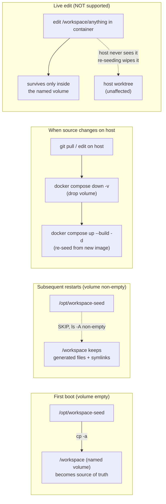
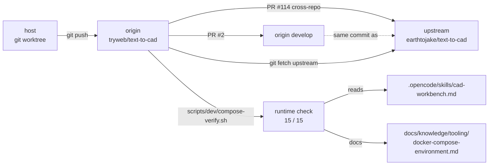

# cad-workbench 容器架構

> 適用於 `feat/docker-compose-environment` 分支合併後的工作環境。
> 入口：`docker-compose.yml`（已從 host bind 改為 named volume + 首次開機 seed）。

## 整體拓樸

```mermaid
flowchart TB
    %% ===================== Host =====================
    subgraph HOST["Host machine"]
        direction TB
        REPO["Worktree<br/>feat/docker-compose-environment<br/>(branched from earthtojake:develop)"]
        REPOFILES["/workspace mount 對應的 host 內容<br/>(在 named volume，不在 host)"]
        COMPOSE["docker-compose.yml<br/>user: 0:0<br/>LOCAL_UID / LOCAL_GID<br/>ports: 5080/5173"]
        UPSTREAM["upstream remote<br/>earthtojake/text-to-cad"]
        BROWSER(["Browser"])

        REPO --> COMPOSE
        UPSTREAM -.-> REPO
        REPOFILES -. bind 已移除 .-> COMPOSE
    end

    %% ===================== Container cad-workbench =====================
    subgraph CONT["Container: cad-workbench"]
        direction TB
        ENTRY["entrypoint.sh (pid 1, root)"]

        subgraph ROOT_STAGE["root stage"]
            UIDMAP["LOCAL_UID/GID<br/>usermod / groupmod"]
            SEED["seed: cp -a<br/>/opt/workspace-seed -> /workspace<br/>(only if volume empty)"]
            CHOWN["chown -R<br/>$UID:$GID /workspace"]
        end

        ENTRY --> UIDMAP
        UIDMAP --> SEED
        SEED --> CHOWN
        CHOWN --> DROP["exec su -c '... /entrypoint.sh --as-opencode'"]

        subgraph OC_STAGE["opencode stage"]
            direction TB
            VENV["ln -sf /opt/venv /workspace/.venv"]
            VIEWER_LINKS["ln -sf /opt/viewer-node-modules/viewer/node_modules<br/>        /workspace/viewer/node_modules<br/>ln -sf /opt/viewer-node-modules/packages/{cadjs,implicitjs}<br/>        /workspace/viewer/packages/*"]
            SKILL_LINKS["ln -sf /opt/viewer-node-modules/skill-viewer/node_modules<br/>        /workspace/skills/cad-viewer/scripts/viewer/node_modules"]
            OC["tmux session 'oc' -> opencode<br/>(run as uid 1000)"]
            TTYD["ttyd :5080 -> tmux attach -t oc"]
            VITE["vite :5173<br/>(cwd = /workspace/viewer)"]
        end

        DROP --> VENV
        DROP --> VIEWER_LINKS
        DROP --> SKILL_LINKS
        DROP --> OC
        DROP --> TTYD
            VITE
        OC -. generated .-> MODELS

        subgraph WS["/workspace (named volume)"]
            direction TB
            SEEDREPO["project tree (seeded)"]
            MODELS["models/<br/>CAD outputs (STEP / STL / GLB / URDF / ...)"]
        end

        VENV -.-> SEEDREPO
        SEEDREPO --- MODELS
        OC -. writes .-> MODELS
    end

    %% ===================== Storage =====================
    subgraph STORAGE["Storage (image-internal + named volumes)"]
        direction TB
        IMG_SEED["/opt/workspace-seed (image layer)<br/>= COPY . . at build time"]
        IMG_VIEWER["/opt/viewer-source/viewer (image layer)"]
        IMG_VENV["/opt/venv (image layer)<br/>Python venv with cadpy etc."]
        IMG_NM["/opt/viewer-node-modules<br/>  viewer/<br/>  skill-viewer/<br/>  packages/{cadjs,implicitjs}"]
        NV_WS["docker volume<br/>opencode_workspace<br/>(mounted at /workspace)"]
        NV_DATA["docker volume<br/>opencode_data<br/>(mounted at /home/opencode/.local/share/opencode)"]
    end

    COMPOSE -->|build| IMG_SEED
    COMPOSE -->|build| IMG_VIEWER
    COMPOSE -->|build| IMG_VENV
    COMPOSE -->|build| IMG_NM
    COMPOSE -->|mount| NV_WS
    COMPOSE -->|mount| NV_DATA

    ENTRY --> IMG_SEED
    SEED --> IMG_SEED
    VENV --> IMG_VENV
    VIEWER_LINKS --> IMG_NM
    SKILL_LINKS --> IMG_NM
    NV_WS --> SEEDREPO

    %% ===================== Flows =====================
    BROWSER ==>|http :5180| TTYD
    TTYD ==>|tmux attach| OC
    BROWSER ==>|http :5173<br/>?dir=/workspace/models| VITE
    VITE ==>|scan + serve| SEEDREPO
    OC -. .-> VITE
```

## 關鍵設計決策與警示



## Port 與服務對照

| Host port | Container port | Process | 用途 |
|---|---|---|---|
| `5180` (`OPENCODE_TTYD_PORT`) | `5080` | ttyd | OpenCode Web Terminal |
| `8081` (`VIEWER_HOST_PORT`) | `5173` | vite | CAD Viewer 開發伺服器 |
| — | `4096` (opencode 內部) | opencode | 透過 tmux 與 ttyd 串接 |

## 模組相依


