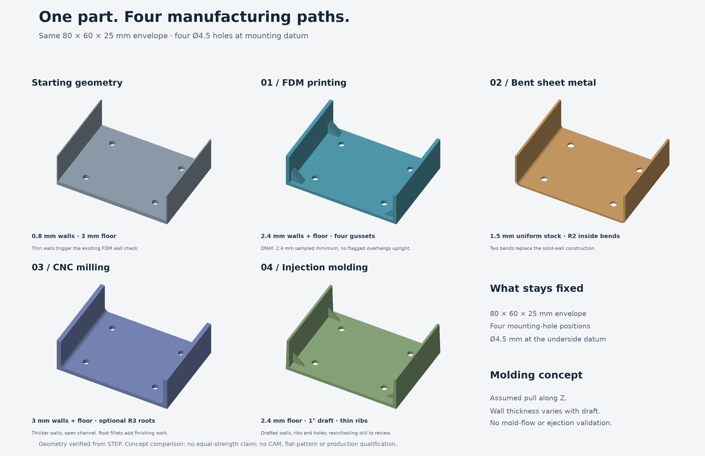

# One mounting tray, four manufacturing processes



*Worked example: FDM adds thicker walls and gussets; sheet metal uses uniform
stock and bends; CNC uses thicker walls and optional rounded roots; injection
molding adds draft and thin ribs. Geometry checked; strength and production
performance remain unverified.*


Controlled design exercise using the existing `dfam-check` skill and the new
`sheet-metal-dfm`, `cnc-dfm`, and `injection-molding-dfm` guided reviews. These are authored redesigns,
not outputs from an automatic optimization solver.

Every variant retains an 80 × 60 × 25 mm envelope and four holes that are Ø4.5 mm at the underside datum
at (±25, ±18) mm, with the underside at Z=0. Interior space changes; equal load
capacity is not established. Materials are illustrative process assumptions,
not measured material assignments: PLA, 5052-H32 sheet, and 6061-T6 billet.

| Variant | Measured geometry | Process rationale | Still unverified |
| --- | --- | --- | --- |
| Baseline | 0.8 mm walls, 3 mm floor | Common starting point | Load capacity |
| FDM | 2.4 mm walls/floor, four 8 mm triangular gussets | Addresses thin walls; upright build | Slicer, loads, layer adhesion |
| Sheet metal | 1.5 mm stock, R2 inside/R3.5 outside bends | Uniform section, two bends | Flat pattern, bend allowance, tooling, springback |
| CNC | 3 mm walls/floor, R3 roots | Less fragile walls; open-ended channel | Workholding, CAM, cutter reach, feeds, loads |

The CNC root fillets are optional transitions, not a mandatory cure for an
unmachinable corner. A flat end mill can produce a sharp floor-to-wall junction;
R3 roots may require corner-radius/ball tooling and extra finishing. Do not
confuse these roots with in-plane pocket corners. This comparison does not
claim cost or cycle-time optimization.

## Checks performed

- Reimported all five STEP exports: each is valid, one solid, correct envelope.
- Intersected exported solids with probes to measure floor/wall thickness.
- Confirmed four hole centers and diameters from actual circular STEP edges.
- Confirmed sheet bend radii and CNC root radius from exported edges.
- Ran `cadgen step inspect validate` on each export; reports are alongside the
  numerical checks in `reports/`.
- Ran the **existing** `skills/dfam-check/scripts/dfam_tool.py measure` on baseline
  and FDM STL with a 45° threshold. Both are watertight, one body. Sampled minimum
  wall thickness rose from **0.8 to 2.4 mm**, clearing the skill's generic FDM
  supported/unsupported wall defaults (1.2/1.6 mm). Sampling is not exhaustive.
- Both baseline and FDM have zero flagged overhang area upright; this redesign
  improves wall thickness, not the already-clear upright overhang result.
- Tested six axis-aligned FDM orientations. Upright: zero flagged area; upside
  down: 4,294.88 mm². This is a geometric heuristic, not slicer verification or
  proof of a globally optimal orientation.
- Visually reviewed CAD snapshots and the comparison figure. The figure uses
  real STL triangles with a depth buffer; colors only distinguish variants.

## Reproduce

Use the repository's cadgen/build123d environment, plus trimesh, numpy, rtree,
networkx, lxml and matplotlib for analysis/figure generation. From this folder:

```sh
for model in src/*.py; do python "$model"; done
python scripts/verify.py
python scripts/figure.py
```

From the repository root, run these for `baseline` and `fdm`:

```sh
python skills/dfam-check/scripts/dfam_tool.py measure models/dfm-process-comparison/STL/fdm.stl --angle-limit 45
python skills/dfam-check/scripts/dfam_tool.py orientations models/dfm-process-comparison/STL/fdm.stl --angle-limit 45
python -m cadgen.cli step inspect validate models/dfm-process-comparison/STEP/fdm.step
```

CAD exports and scratch images are regenerable and ignored. The share image is
`tmp/manufacturing-comparison.png`. A deliberate, committed review copy lives at
`docs/manufacturing-comparison.png` so the README and PR have a durable visual.
After regenerating and visually reviewing a changed figure, copy it there to
refresh the published comparison. Recorded JSON reports capture this run.

## Caption for Jake

Same mounting interface, four manufacturing approaches: FDM gets thicker walls
and gussets; sheet metal becomes uniform stock with two bends; CNC gets thicker
walls and optional rounded roots; injection molding adds draft and thin ribs. The existing DfAM checker measured the print
version's minimum wall thickness increasing from 0.8 to 2.4 mm. Geometry checked;
strength, tooling, and production performance still need validation.

## Injection-molding fourth process

Concept assumes an untextured, unfilled thermoplastic (resin grade unspecified),
Z pull and parting near the bottom perimeter. These are design assumptions, not
supplier-approved limits. The floor is 2.4 mm; the two inner and two outer tall
wall surfaces have 1° draft verified from STEP surface normals. Opposing draft
makes walls taper (about 2.36 mm above the floor to 1.57 mm at the rim), so this
is not a uniform-wall claim. Four triangular ribs have nominal 1.2 mm feet and
1° tapered side faces. The holes open upward with 1° draft: Ø4.5 at Z=0, about
Ø4.584 at the floor top. Mounting centers and the underside datum are preserved.

Geometry assertions check wall draft, sampled rib widths, floor thickness,
envelope and datum hole diameters. The STEP validator checks solid validity.
The thin ribs illustrate reducing bulk at junctions compared with the FDM
gussets; no sink or strength performance was simulated. Rib/root fillets are
not modeled yet and need review alongside stress and local wall transitions.
Toolmaker review is still required for resin, texture, shrinkage, parting and
shutoffs, gate/vent locations, cooling, ejection and the complete withdrawal
path. No undercut-free verdict or mold-flow result is claimed.
